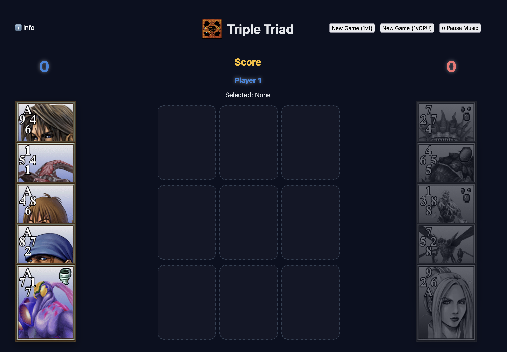
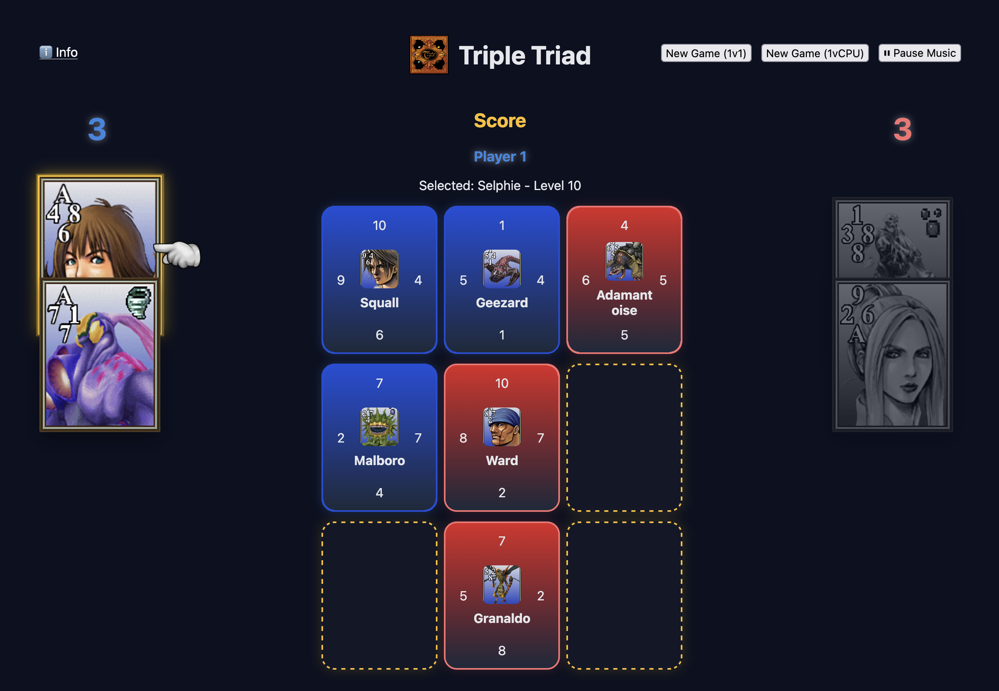
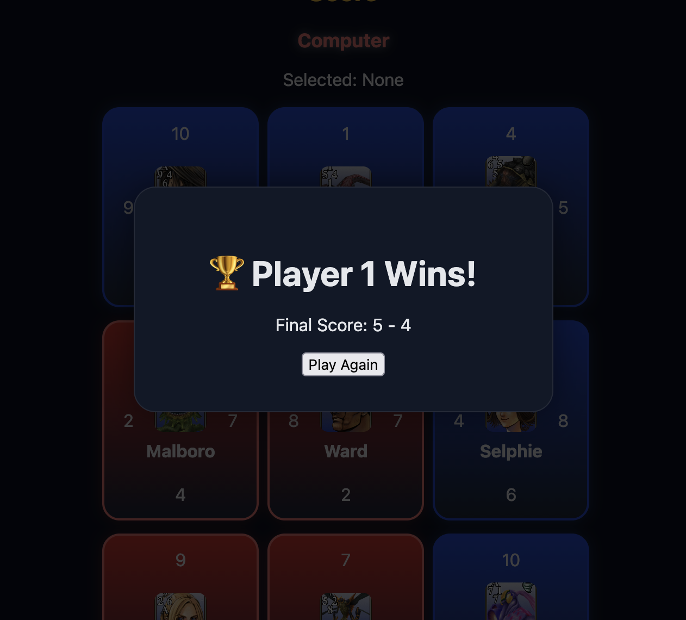

# 🃏 Triple Triad React Game

A browser-based implementation of a **Triple Triad-style card game**, built with React.  
The game features turn-based mechanics, card captures, dynamic scoring and artwork support.

---

## 🎮 Features

- 🔄 Turn-based gameplay (Player 1 vs Player 2 or Player 1 vs COM)
- 🃏 Unique card system with stats (attack / defense / ownership)
- 🧠 Capture mechanics inspired by Triple Triad rules
- 🎨 Card artwork support (image-based cards)
- 📊 Live score calculation
- 🏁 Game over detection + winner modal
- 🔁 Restart / replay functionality
- ✨ Capture visual feedback (animations + highlights)

---

## 🧱 Tech Stack

- React (Hooks-based architecture)
- TypeScript
- Vite
- CSS (custom styling)
- Functional state management (no external state library)

---

## 📁 Project Structure

```bash
/src
|--- /components
     |--- Board.tsx
     |--- Card.tsx
     |--- Hand.tsx
     |--- ResultModal.tsx
|--- /hooks
     |--- useGame.ts
|--- /utils
     |--- gameHelpers.ts
|--- /data
     |--- cards.ts
|--- /types
     |--- game.ts
|--- /public
     |--- /cards
          |--- ifrit.png
```


---

## 🧠 Game Logic Overview

### Board
- 3x3 grid (9 cells)
- Cards are placed on empty cells only

### Turns
- Player 1 starts
- Players alternate turns after each valid move

### Capture Rules
After placing a card:
- Adjacent enemy cards are compared
- If your side is stronger → you capture the card
- Board updates instantly

### Win Condition
Game ends when:
- All board cells are filled OR
- No valid moves remain

Winner is determined by:
- Total owned cards on the board

---

## 🎨 Card System

Each card includes:

```ts
type CardType = {
  id: number | string;
  name: string;
  top: number;
  right: number;
  bottom: number;
  left: number;
  owner?: Player;
  image: string;
  element?: string | null;
  level: number;
};
```

Images are stored in:
```bash
/public/cards
```

## 🚀 Getting Started

### 1. Install dependencies
```bash
yarn install
```

### 2. Run the project
```bash
yarn dev
```

### 3. Open in browser
```bash
http://localhost:5173/
```

---

## 🔧 Possible Improvements
- AI opponent (advanced)
- Ranked matchmaking system
- Drag & drop card placement
- Deck builder system
- Online multiplayer (WebSocket / Socket.io)
- Animated card battles

---

## 🧩 Future Ideas
- Card rarity system
- Elemental advantages (fire / water / etc.)
- Campaign mode
- Leaderboard system
- Card evolution mechanics

---

## 📸 Preview





---

## 🧑‍💻 Author / Credits

Built with React as a learning + experimental game project focused on:
- state management patterns
- game logic design
- UI feedback systems

All game concepts and designs are based on work by `Square Enix`, and music is property of `Square Enix`.
<br>`Game images` and `sounds` used in this project are part of FFVIII mods by <a href="https://github.com/itdelatrisu/" target="_blank">@itdelatrisu</a>

---

## 📄 License

MIT
